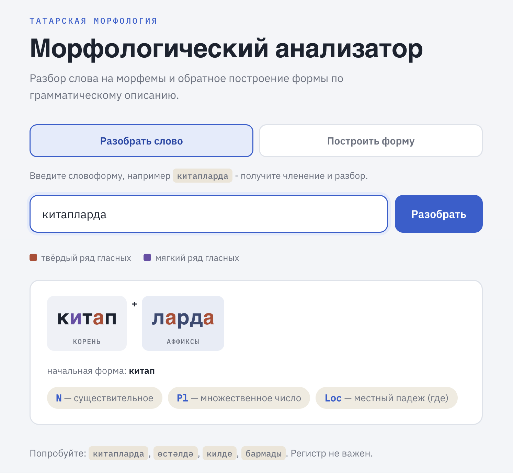

# Морфологический анализатор татарского языка

Программа разбирает татарские словоформы. По слову определяет начальную
форму (лемму) и грамматические признаки (часть речи, число, падеж, для
глаголов - время, лицо, отрицание). Может делать обратное, т.е. генерацию формы
по разбору.

Пример:

```
китапларда  →  китап + N + Pl + Loc   (книга, мн. число, местный падеж)
бармады     →  бар + V + Neg + Past + 3Sg
```


## Зачем это нужно

Для языков с большим объёмом ресурсов морфологические анализаторы
существуют давно, а для языков поменьше - часто нет. Без них трудно
делать поиск по текстам, проверку орфографии, обучающие инструменты и
помогать лингвистам, документирующим язык. Этот проект - рабочий
анализатор татарской морфологии (существительные и глаголы), который
можно расширять.

## Кому полезен

- Изучающим татарский язык - увидеть строение незнакомой словоформы.
- Разработчикам языковых инструментов - как готовый компонент разбора.
- Лингвистам - как основа для морфологической разметки текстов.

## Как это устроено

Морфология реализована на Python: словарь основ, парадигмы суффиксов и
фонологические правила (сингармонизм, ассимиляция). На их основе
заранее генерируется словарь всех форм, по которому идёт разбор.

```
fst/lexicon.py      словарь основ (существительные, глаголы)
fst/morphology.py   парадигмы: число, падежи, времена, лица
fst/phonology.py    сингармонизм и ассимиляция согласных
fst/build.py        генерирует все формы -> fst/tatar.json
src/analyzer.py     функции analyze() и generate() - граница частей
src/cli.py          разбор из командной строки
src/web.py          веб-интерфейс на Flask
src/templates/      шаблон страницы
tests/              автоматические тесты
```

Главная лингвистическая особенность - **сингармонизм**: гласный
суффикса подстраивается под гласные основы (после твёрдых «-лар», после
мягких «-ләр»), а согласный - под глухость/звонкость предыдущего звука
(«китап-**т**а», но «өстәл-**д**ә»). Обрабатывается также более тонкий
случай - назальная ассимиляция (борын + дан → борын**нан**).

## Установка

Нужен Python 3 и зависимости:

```bash
python3 -m pip install -r requirements.txt
```

(Ядро работает на чистом Python; Flask нужен только для веб-интерфейса.)

## Запуск

### 1. Собрать словарь форм

Делается один раз, а также после изменений в `fst/`:

```bash
python3 fst/build.py
```

### 2. Командная строка

```bash
python3 src/cli.py китапларда
```

### 3. Веб-интерфейс

```bash
python3 src/web.py
```

Открыть `http://127.0.0.1:5000`. На странице два режима:

- **Разобрать слово** - ввести словоформу (например, `китапларда`),
  получить разбор с расшифровкой признаков.
- **Построить форму** - ввести разбор (например, `кил+V+Past+3Sg`),
  получить словоформу (`килде`).

## Тесты

```bash
python3 -m pytest tests/ -v
```

Проверка стиля кода (PEP-8):

```bash
python3 -m flake8 src/ tests/ fst/ --max-line-length=99
```

## Что поддерживается

- Существительные: число (ед./мн.) и 6 падежей
  (Nom, Gen, Dat, Acc, Loc, Abl).
- Глаголы: повелительное, прошедшее и настоящее время; лица; отрицание.
- Сингармонизм, ассимиляция согласных, назальная ассимиляция.
- Анализ и генерация (в обе стороны).
- Обработка краевых случаев: пустой ввод, незнакомые слова, цифры,
  регистр, неоднозначные разборы.

## Что пока не поддерживается (границы проекта)

- Прочие части речи (прилагательные, местоимения и т. д.).
- Притяжательные показатели, сложные глагольные формы.
- Заимствования с нестандартным сингармонизмом.